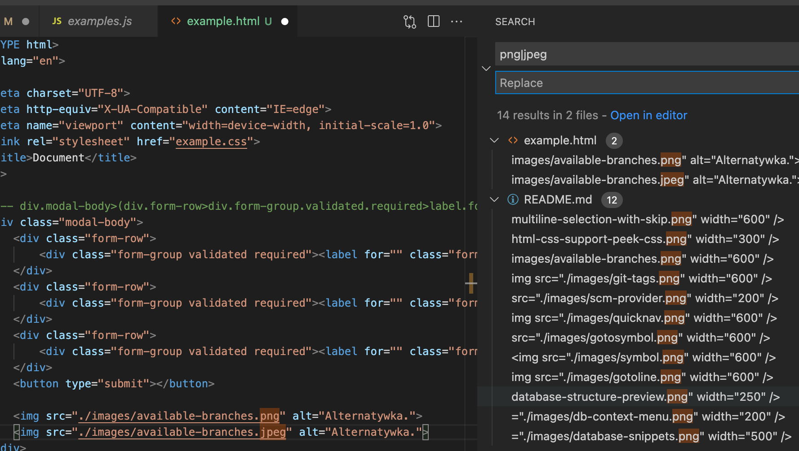
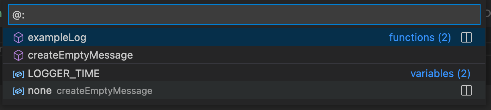
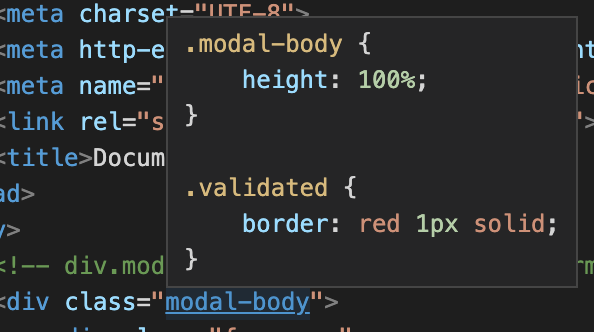
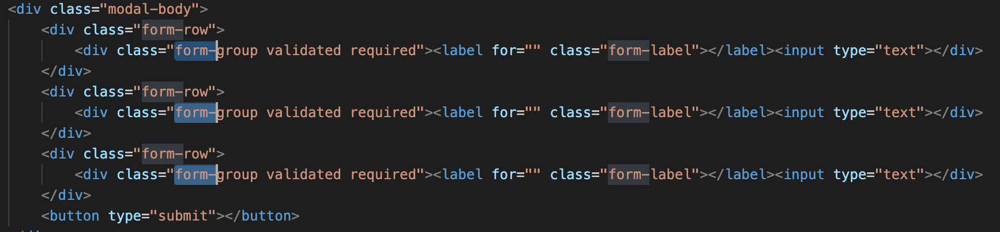
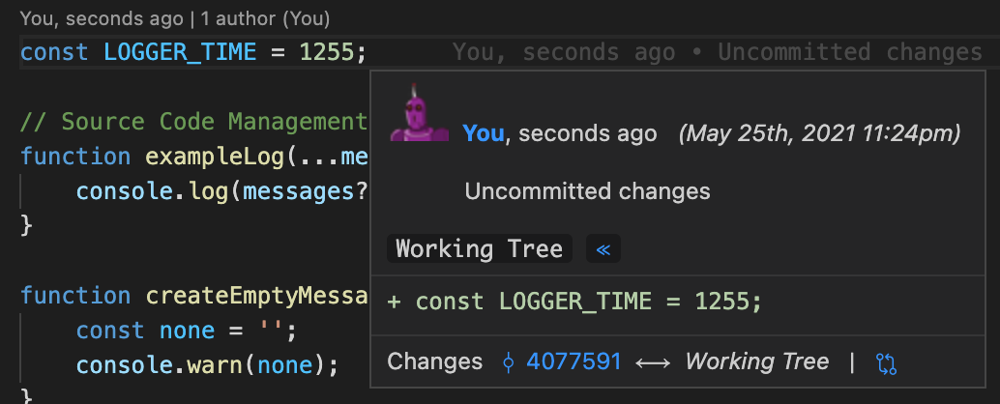
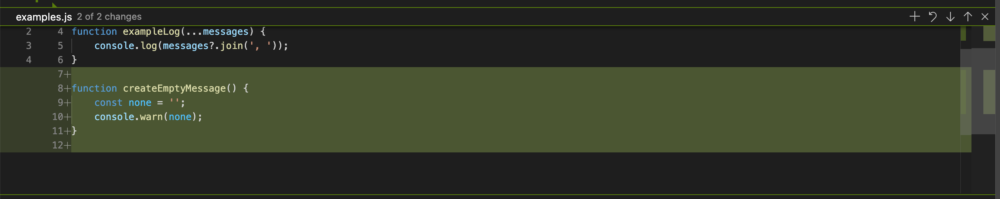
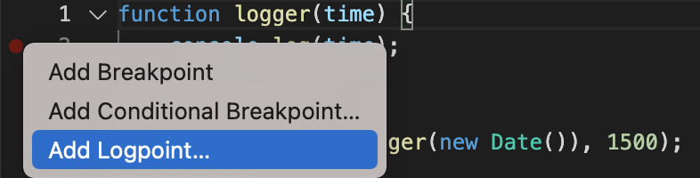
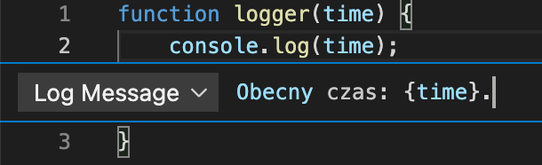
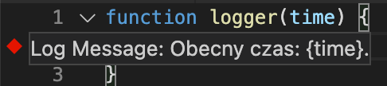
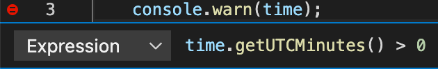

# Skróty i modyfikacje UI zwiększające produktywnośc
- Sidebar focus: **ctrl/cmd + 0**
- Source code focus: **ctrl/cmd + 1**
- File explorer: **ctrl/cmd + shift + E**
- Regions: JS regions & HTML regions
- Fold/Unfold: **shift + ctrl + [ oraz shift + ctrl + ] (option + command + [ oraz option + command + ])**
  - Visual Studio Code wspiera uzywanie regionów w kodzie HTML, CSS oraz JS (TS), regiony mozemy powiazac z tym skrotem
- Quick commend: **ctrl/cmd + /**
- Last closed tab: **shift + ctrl/cmd + T**

## Skróty wyszukiwania i modyfikacji kodu
- Przesuwanie tekstu góra/dół: **Opt/Alt + Up Arrow**
- Powielanie kodu: **Opt/Alt + Shift + Down Arrow**
- Kasowanie kodu: **Cmd/Ctrl + Shift + K**
- Refaktoryzacja nazwy zaznaczonego symbolu: **F2**
  - Refaktoryzacja nazwy jest bezpieczniejsza od prostej zmiany nazwy, ze wzgledu na bezpieczna zmiane wszystkich miejsc, ktore referuja do modyfikowanego symbolu.
- Wyszukanie wszystkich referencji do zaznaczonego symbolu: **Shift + F12**

### Wyszukiwanie z wykorzystaniem Regex
Wystarczy prosta znajomosc skladni Regex, aby znacznie ulatwic wyszukiwanie i masowa zmiane wskazanych tagow.


### Wyszukiwarka symboli
#### Wyszukiwanie plików
Visual Studio Code udostępnia 2 wyszukiwarki plików
- Panel wyszukiwania
- Okno interaktywnego wyszukiwania

Panel wyszukiwania pozwala na zaawansowanie wyszukiwanie wraz z wyrazeniami regularnymi i wykluczaniem folderów.

Okno wyszukiwarki plików pozwala na szybkie wyszukiwanie plików. Otwieramy je skrótem CMD + P / SHIFT + CTRL + P.


#### Wyszukiwanie symboli
Wykorzystują znak **`@`** nawigujemy do symboli w ramach aktywnego pliku.

Wykorzystują znak **`#`** nawigujemy do symboli we wszystkich plikach workspace.


#### Wyszukiwanie symboli z grupowaniem
Mozemy rozszerzyc poprzedni punkt poprzez dodanie grupowania do wyszukanych symboli. Wystarczy dodac znak `:`, tak wiec wyszukujac `@:` grupujemy po typie symbolu.


#### Przechodzenie do linii
Wykorzystują znak **`:`** nawigujemy do wskazanej linii w ramach aktywnego pliku.


### Rozszerzenie HTML CSS Support
Rozszerzenie wydane przez **ecmel** pozwala na nawigację w plikach HTML oraz CSS zblizona do nawigacji dostarczanej przez Visual Studio Code. Co rowniez istotne, rozszerzenie udostepnia automatyczne podpowiadanie dostepnych klas podczas deklarowania atrybutu `class` lub `id` (**ctrl + space**).

#### Peek Definition
Naciskając klasisz ctrl włączamy funkcjonalnoś **Peek Definition**, klikając na nazwę klasy mozemy do niej przejsc.  


## Multiline Selection
To podstawa w nowoczesnych edytorach, dzieki zaznaczeniu w wielu liniach mozemy bardzo prosto aktualizowac zblizone nazewnictwo.  
Co wazne, Visual Studio Studio m. in. na:
- Ustawienie kursora przy wszystkich wskazanych słowach kluczowych
- Manualne zaznaczanie kolejnych wystąpień słowa kluczowego (ctrl + d)
- Pomijanie podczas zaznaczania manualnego słowa kluczowego (ctrl + k)



## Emmet
Emmet to narzędzie pozwalające na wygenerowanie zaawansowanego kodu HTML lub CSS wykorzystując język zblizony składniowo do CSS.  

### Wyrazenia Emmet
Przykładowe wyrazenie Emmet:
```html
div.modal-body>(div.form-row>div.form-group.validated.required>label.form-label+input[type=text])*3+button[type=submit]
```
Wygenerowany rezultat:
```html
<div class="modal-body">
    <div class="form-row">
        <div class="form-group validated required"><label for="" class="form-label"></label><input type="text"></div>
    </div>
    <div class="form-row">
        <div class="form-group validated required"><label for="" class="form-label"></label><input type="text"></div>
    </div>
    <div class="form-row">
        <div class="form-group validated required"><label for="" class="form-label"></label><input type="text"></div>
    </div>
    <button type="submit"></button>
</div>
```

Wyrazenie Emmet:
```
link:css
```
Wygenerowany rezultat:
```html
<link rel="stylesheet" href="style.css">
```

Wyrazenie Emmet:
```
h100p
```
Wygenerowany rezultat
```css
height: 100%;
```
### Komendy Emmet
Emmet dostarcza niezliczoną ilosc komend pozwalających na modyfikacje plików HTML oraz CSS. Ponizej przedstawiam te najbardziej uzyteczne w codziennej pracy.

> Emmet: Wrap with Abbreviation

Bardzo uzyteczna komenda pozwalajaca dodac tag nad tagiem przy ktorym mamy kursor.

> Emmet: Remove Tag

Kolejna bardzo uzyteczna komenda, dzieki ktorej nie kasujemy recznie tagu rozpoczynajacego oraz zamykajacego, kasuje jednoczesnie oba.

> Emmet: Go To Matching Pair  

Przenosi kursor do tagu rozpoczynającego / zamykającego.

> Emmet: Balance (outward) oraz Emmet: Balance (inward)

Zwiększa lub zmniejsza rozmiar zaznaczenia o cały tag przy którym znajduje się kursor.


# Version Control
Wbudowane narzedzie SCM w Visual Studio Code pozwala na zarządzanie repozytorium oraz rozwiązywanie merge, a dzięki rozszerzeniu GitLens zyskujemy zaawansowane wizualnie narzędzie do zarządzania kodem.  
Obecne w Visual Studio Code narzędzie zastepuje wiekszosc funkcji innych narzedzi takich jak SourceTree lub Sublime Merge, a jednocześnie działa znacznie wydajnie. ni np. SourceTree.

Ponizej krotka lista podsumowujaca co mozemy zrobic w podstawowym narzedziu SCM:
- Inicjalizacja repozytorium
- Podpinanie repozytorium zdalnego
- Podstawowe operacje na repozytorium (stages, commits, merge, pulling, pushing, sync, tags)
- Podstawowe opcje GitLens 
- Ustawienia rozszerzenia GitLens


<br>
<br>

## Source Control Provider
Visual Studio Code nie jest ograniczone do pracy z Source Control git, mozemy doinstalowac rozszerzenie pozwalające na zarządzanie kodem w SVN, a nawet TFS.


## Rozszerzenie GitLens
Podstawowe narzedzie SCM mozemy znacznie rozbudowac poprzez doinstalowanie rozszerzenia GitLens.  
Najciekawszym rozwiazaniem dostarczonym przez GitLens jest wiele sposobów w jaki mozemy przeglądac historię repozytorium, ponizej kilka z nich.

### Ostatnia zmiana prezentowana in-line
Poza samym podgladem mozemy przejsc do repozytorium zdalnego, porownac zmiany z poprzednia wersja lub rozpoczac wersje Live Share.


### Podgląd ostatniej modyfikacji
Poza samym podgladem dzieki przyciskom prezentowanym na belce mamy mozliwosc zrobienia operacji `stage` dla wskazanej zmiany lub cofniecia jej do poprzedniej wersji.


# Wstęp do debugowania
Rozdział zostanie rozwinięty w następnej części szkolenia, tutaj tylko wskazuję dwie ciekawsze funkcjonalnosci bardzo przydatne w pracy.

## Log Point
Debugowanie wartości w kodzie JS bardzo często sprowadza się do wykorzystania klasy `console` i uzycia metody `log` do zaprezentowania wartości. Problem pojawia się, gdy debugujemy duza aplikacje, chcemy dodac nowe logowanie, a przebudowanie aplikacji trwa długo. Visual Studio Code rozwiązuje ten problem poprzez mozliwosc dodawania dynamicznych Log Point bez modyfikacji kodu.

Rozwiazanie bez uzycia LogPoint:
```js
function exampleLog(...messages) {
    console.log(messages?.join(', '));
}
```

Rozwiązanie z uzyciem LogPoint.  
Inny typ breakpoint'ów dodajemy klikając prawym na polu tworzenia breakpointów.  
  
Deklarujemy logowaną wiadomośc. Mamy dostep do wszystkich zmiennych w klasie wylacznie w ramach klamr (`{ }`).  
  
LogPoint prezentowany jest inaczej niz standardowy breakpoint, ponadto po najechaniu prezentuje logowaną wiadomośc.  
  

Efekt obu rozwiązań jest taki sam, wartoś logowany jest w **Debug Console**.

## Hit Count (Conditional Breakpoint)
Jak sama nazwa mówi, pozwoli nam na dodanie warunkowego breakpointu, który wykonuje się wyłacznie podczas spelnienia warunku. Mozemy wykorzystac ten typ breakpointu, gdy debugujemy rezultat z wywolania endpointu i oczekujemy np. na konkretny typ we wskazanym polu.

Inny typ breakpoint'ów dodajemy klikając prawym na polu tworzenia breakpointów.  
  
Deklarujemy logowaną wiadomośc. Mamy dostep do wszystkich zmiennych w klasie wylacznie w ramach klamr (`{ }`).  
HitPoint prezentowany jest inaczej niz standardowy breakpoint, ponadto po najechaniu prezentuje logowaną wiadomośc.  

## Rozszerzenia
### Rozszerzenie: Jira and Bitbucket (Official)
Rozszerzenie udostępnia funkcjonalności spełniajace wszystki potrzeby dewelopera w ramach Jira i Bitbucket. Rozszerzenie przede wszystkim udostępnia:
- Podgląd przypisanych zadań
- Tworzenie oraz zarządzanie utworzonymi zadaniami
- Logowanie czasu pracy
- Tworzenie zadań bezpośrednio z kodu oznaczonego wybranym tagiem np. **TODO**, **FIXME**
- Tworzenie, przeglądanie oraz zamykanie Pull Requestów
- Weryfikowanie stanu buildów
#### Jira
Dodac zdjecia
#### Bitbucket
Dodac zdjecia

### SQL Server
Rozszerzenie pozwala na podstawowe zarządzanie bazą, w tym m.in.:
- Deklarowanie wielu połączeń bazodanowych
- Wykonywanie instrukcji języka T-SQL wraz ze wsparciem InteliSense
- Wizualny podgląd struktury oraz zawartości bazy
- Eksport danych do CSV, JSON lub pliku tekstowego


<br><br>
Rozszerzenie udostępnia równiez pakiet snippetów języka T-SQL.

