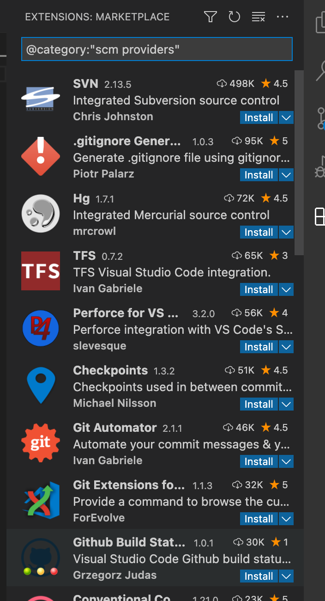
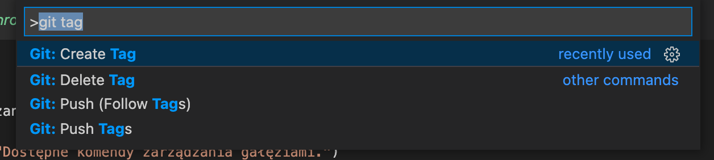
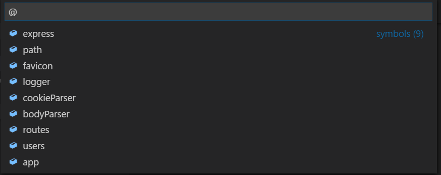
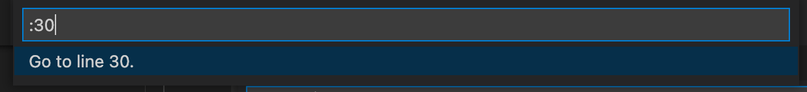
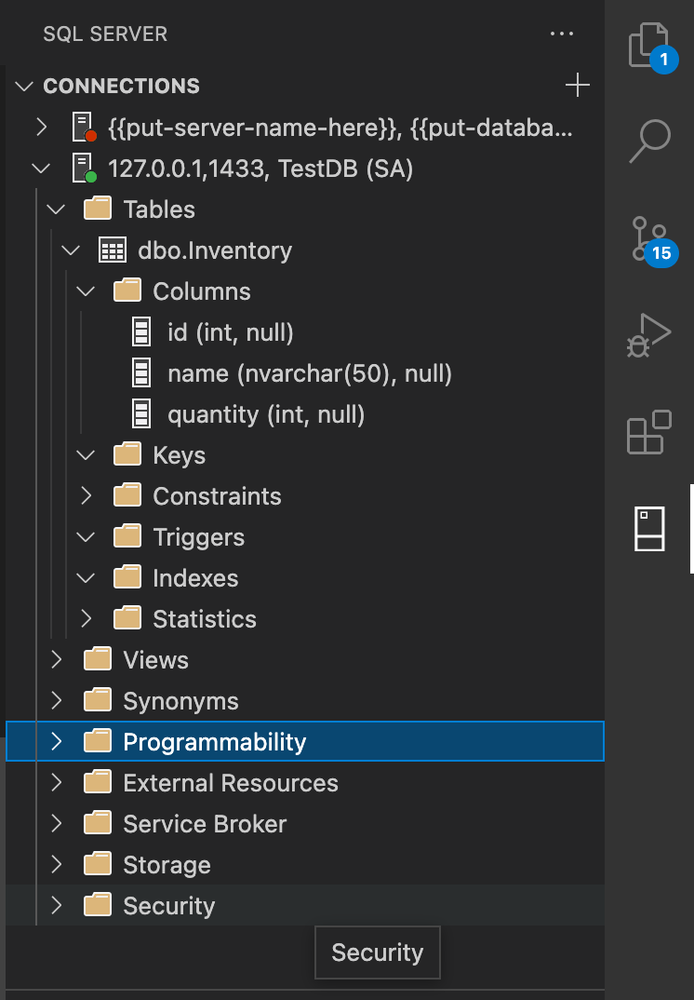
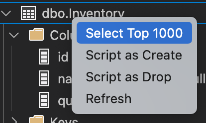
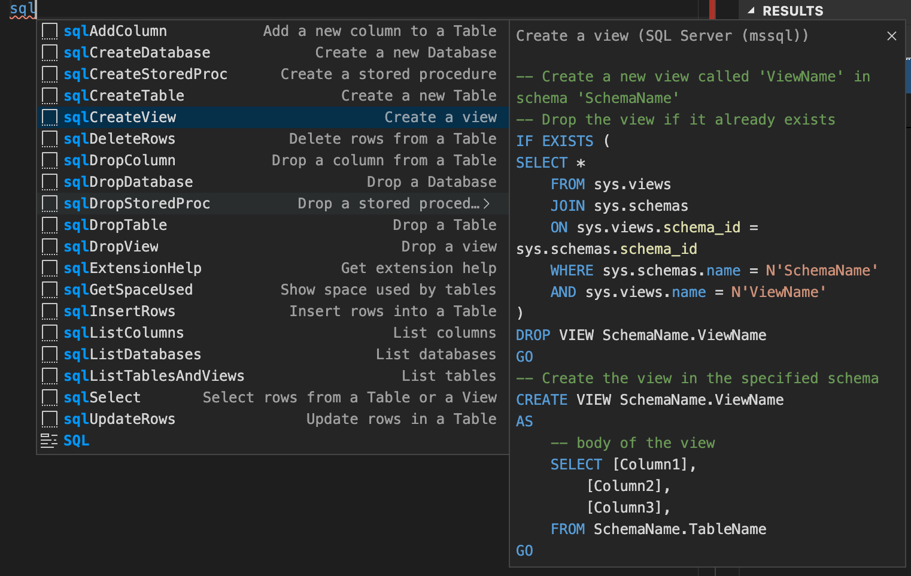

# Version Control
Wbudowane narzedzie SCM w Visual Studio Code pozwala nam na zarządzanie repozytorium oraz rozwiązywanie merge, a dzięki rozszerzeniu GitLens zyskujemy zaawansowane wizualnie narzędzie do zarządzania kodem.

## Source Control Provider
Visual Studio Code nie jest ograniczone do pracy z Source Control git, mozemy doinstalowa rozszerzenie pozwalające na zarządzanie kodem w SVN, a nawet TFS.

## Podstawowe operacje na repozytorium

### Branching
Version Control pozwala nam na zarządzanie gałęziami oraz oznaczanie wersji kodu tagiem bezpośrednio w edytorze.

  

## Skróty zwiększające produktywnośc

## Nawigacja
### Wyszukiwanie plików
Visual Studio Code udostępnia 2 wyszukiwarki plików
- Panel wyszukiwania
- Okno interaktywnego wyszukiwania

Panel wyszukiwania pozwala na zaawansowanie wyszukiwanie wraz z wyrazeniami regularnymi i wykluczaniem folderów.

Okno wyszukiwarki plików pozwala na szybkie wyszukiwanie plików. Otwieramy je skrótem CMD + P / SHIFT + CTRL + P.

### Wyszukiwanie symboli
Wykorzystują znak **`@`** nawigujemy do symboli w ramach aktywnego pliku.

Wykorzystują znak **`#`** nawigujemy do symboli we wszystkich plikach workspace.

### Przechodzenie do linii
Wykorzystują znak **`:`** nawigujemy do wskazanej linii w ramach aktywnego pliku.

---
## Rozszerzenia
### Rozszerzenie: GitLens
### Rozszerzenie: Jira and Bitbucket (Official)
Rozszerzenie udostępnia funkcjonalności spełniajace wszystki potrzeby dewelopera w ramach Jira i Bitbucket. Rozszerzenie przede wszystkim udostępnia:
- Podgląd przypisanych zadań
- Tworzenie oraz zarządzanie utworzonymi zadaniami
- Logowanie czasu pracy
- Tworzenie zadań bezpośrednio z kodu oznaczonego wybranym tagiem np. **TODO**, **FIXME**
- Tworzenie, przeglądanie oraz zamykanie Pull Requestów
- Weryfikowanie stanu buildów
#### Jira
Dodac zdjecia
#### Bitbucket
Dodac zdjecia

  
### SQL Server
Rozszerzenie pozwala na podstawowe zarządzanie bazą, w tym m.in.:
- Deklarowanie wielu połączeń bazodanowych
- Wykonywanie instrukcji języka T-SQL wraz ze wsparciem InteliSense
- Wizualny podgląd struktury oraz zawartości bazy
- Eksport danych do CSV, JSON lub pliku tekstowego

  
Rozszerzenie udostępnia równiez pakiet snippetów języka T-SQL.

## Debugowanie - częśc 1
### Logpoint
### Hitcount